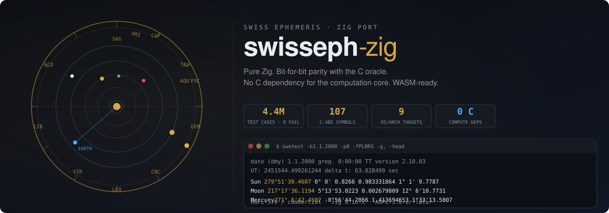

<div align="center">
  
</div>

# swisseph-zig

**Swiss Ephemeris, rewritten in pure Zig.** Planetary positions, houses,
eclipses, rise/set, heliacal events, fixed stars, asteroids — verified
bit-for-bit against the C oracle across 4.4 million test cases.

[](https://github.com/mshafiee/swisseph-zig/actions/workflows/ci.yml)
[](https://ziglang.org)
[](LICENSE)

---

## Why

The upstream Swiss Ephemeris C library is the gold standard for astronomical
computation — but it's C. This port gives you the same algorithms and the same
precision in **memory-safe Zig**: no `malloc`, no UB, no cross-toolchain
installs, and a first-class `zig fetch` dependency for your build.

| | C library | swisseph-zig |
|---|---|---|
| Computation core | C (9 `.c` files) | **Pure Zig** (12 modules) |
| Bit parity | reference | **== vs C oracle** (4.4M cases) |
| Cross-compilation | per-target toolchain | **`zig build -Dtarget=<triple>`** |
| WASM | not supported | **`libswe.a` (no libc)** |
| Memory safety | `malloc`/`free` + UB risk | Zig allocators + bounds checks |

## Quick start

### Zig dependency

```sh
zig fetch --save git+https://github.com/mshafiee/swisseph-zig
```

```zig
const std = @import("std");
const swe = @import("swisseph");

pub fn main(init: std.process.Init) !void {
    _ = init;
    var swed = swe.sweph.Swed{};       // engine state (files, caches)
    var dctx = swe.deltat.DeltatCtx{}; // delta-T state
    const models = swe.swephlib.AstroModels{};
    var xx: [6]f64 = undefined;
    var serr: [256]u8 = undefined;
    const jd_ut = swe.julday(2000, 1, 1, 12.0, swe.swedate.SE_GREG_CAL);
    _ = swe.calc_ut(jd_ut, 0, swe.sweph.SEFLG_SPEED, &xx, &swed, models, &dctx, &serr);
    std.debug.print("Sun: {d:.6}°\n", .{xx[0]});
}
```

Every computation takes its state as explicit parameters — nothing hides in
module-level globals (see [Threading contract](#threading-contract)).

### C ABI drop-in

```sh
make native
cc myprog.c -Idist/<host>/include -Ldist/<host>/lib -lswe -lm -o myprog
```

The exported `swe_*` symbols cover all 107 upstream `swephexp.h` API
functions (119 exported incl. internal shims) — existing C code
compiled against the upstream library links without source changes.

### CLI tools

```sh
make && ./zig-out/bin/swetest -b1.1.2000 -p0 -fPLBRS -g, -head
```

```
date (dmy) 1.1.2000 greg.   0:00:00 TT    version 2.10.03
UT:  2451544.499261244     delta t: 63.828499 sec
Sun        , 279°51'30.4607,   0° 0' 0.8266,   0.983331864,   1° 1' 9.7787
Moon       , 217°17'36.1194,   5°13'53.0223,   0.002679809,  12° 6'10.7731
Mercury    , 271° 6'42.4502,  -0°56'44.2866,   1.413694653,   1°33'13.5807
...
```

## What's inside

```
src/
├── swisseph.zig   ← facade: @import("swisseph") re-exports everything
├── sweph.zig      ← swe_calc engine, file machinery, fixstars, asteroids
├── swephlib.zig   ← precession, nutation, obliquity, coordinate transforms
├── swemmoon.zig   ← Moshier moon
├── swemplan.zig   ← Moshier planets + fictitious bodies (seorbel)
├── swejpl.zig     ← JPL binary file reader (DE200/DE406/DE441)
├── swehouse.zig   ← 25 house systems
├── swecl.zig      ← eclipses, rise/set, azalt, pheno, nod_aps, gauquelin
├── swehel.zig     ← heliacal events, visibility limits
├── swedate.zig    ← calendar conversions
├── deltat.zig     ← delta-T models
├── swe_abi.zig    ← C-ABI: all 107 swe_* API exports (threadlocal SweState)
└── libm/cr.zig    ← correctly-rounded f128 math (for -Dpure)
```

Plus the differential-test harness (`difftest.zig` + per-module checkers)
and race stress tests (`test_stress_race.zig`, `verify/concurrent/`) used
by the verification gate.

<details>
<summary>All 107 C-ABI symbols</summary>

`swetest` consumers get every public function from `swephexp.h`:
`swe_calc`, `swe_calc_ut`, `swe_calc_pctr`, `swe_fixstar`, `swe_fixstar2`,
`swe_fixstar_mag`, `swe_houses`, `swe_houses_ex`, `swe_houses_ex2`,
`swe_houses_armc`, `swe_houses_armc_ex2`, `swe_house_pos`, `swe_house_name`,
`swe_cotrans`, `swe_cotrans_sp`, `swe_sol_eclipse_where`, `swe_sol_eclipse_how`,
`swe_sol_eclipse_when_glob`, `swe_sol_eclipse_when_loc`, `swe_lun_eclipse_how`,
`swe_lun_eclipse_when`, `swe_lun_eclipse_when_loc`, `swe_lun_occult_where`,
`swe_lun_occult_when_glob`, `swe_lun_occult_when_loc`, `swe_pheno`,
`swe_pheno_ut`, `swe_refrac`, `swe_refrac_extended`, `swe_azalt`,
`swe_azalt_rev`, `swe_rise_trans`, `swe_rise_trans_true_hor`, `swe_nod_aps`,
`swe_nod_aps_ut`, `swe_get_orbital_elements`, `swe_orbit_max_min_true_distance`,
`swe_gauquelin_sector`, `swe_heliacal_ut`, `swe_heliacal_pheno_ut`,
`swe_heliacal_angle`, `swe_vis_limit_mag`, `swe_topo_arcus_visionis`,
`swe_set_topo`, `swe_set_sid_mode`, `swe_set_ephe_path`, `swe_set_jpl_file`,
`swe_set_interpolate_nut`, `swe_set_tid_acc`, `swe_get_tid_acc`,
`swe_set_delta_t_userdef`, `swe_set_lapse_rate`, `swe_deltat`, `swe_deltat_ex`,
`swe_time_equ`, `swe_julday`, `swe_revjul`, `swe_date_conversion`,
`swe_utc_to_jd`, `swe_jdet_to_utc`, `swe_jdut1_to_utc`, `swe_utc_time_zone`,
`swe_get_ayanamsa`, `swe_get_ayanamsa_ex`, `swe_get_ayanamsa_ex_ut`,
`swe_get_ayanamsa_ut`, `swe_get_ayanamsa_name`, `swe_get_planet_name`,
`swe_get_current_file_data`, `swe_close`, `swe_version`, `swe_get_library_path`,
`swe_degnorm`, `swe_radnorm`, `swe_difdeg2n`, `swe_difrad2n`, `swe_difdegn`,
`swe_deg_midp`, `swe_rad_midp`, `swe_split_deg`, `swe_csnorm`, `swe_difcsn`,
`swe_difcs2n`, `swe_csroundsec`, `swe_d2l`, `swe_day_of_week`,
`swe_cs2timestr`, `swe_cs2lonlatstr`, `swe_cs2degstr`, …
</details>

## Targets

| Target | libswe | Tools |
|---|---|---|
| `x86_64-linux` | `.a` + `.so` | ELF bins |
| `aarch64-linux` | `.a` + `.so` | ELF bins |
| `x86_64-freebsd` | `.a` + `.so` | ELF bins |
| `aarch64-freebsd` | `.a` + `.so` | ELF bins |
| `x86_64-macos` | `.a` + `.dylib` | Mach-O bins |
| `aarch64-macos` | `.a` + `.dylib` | Mach-O bins |
| `x86_64-windows` | `.lib` + `.dll` | `.exe` |
| `wasm32-freestanding` | `.a` | — |
| `wasm32-wasi` | `.a` | WASI bins |

## Build

```sh
make              # host → dist/<host-triple>/
make all          # all 9 targets → dist/<triple>/
make test         # unit tests
make lint         # zig fmt --check
```

```sh
zig build                          # default (libm shim, bit-exact)
zig build -Dpure=true              # pure Zig math (auto-forced on wasm+win)
zig build -Dtarget=x86_64-windows  # cross-compile, no toolchain needed
```

## Data files

Works out of the box with **no data files** using the built-in Moshier
ephemeris (`SEFLG_MOSEPH`). For higher precision, download the Swiss
Ephemeris `.se1` files from [astro.com](https://www.astro.com/ftp/swisseph/ephe/)
and call `swe_set_ephe_path("ephe/")`. See [docs/data-files.md](docs/data-files.md).

## Parity methodology

Every module was ported 1:1 — exact floating-point operation order, exact
constants, exact table values — and verified with `==` (never a tolerance)
against a C oracle compiled with `-ffp-contract=off`. The verification
harness lives in a companion repo. See [docs/parity.md](docs/parity.md)
for the FMA trap, the `libm` strategy, and the correctly-rounded fallback.

## Threading contract

All mutable library state lives in explicit per-instance context structs:
`Swed` (including its `moon_ws`, `plan_ws`, `jpl` and fixstar-cache members),
`DeltatCtx`, `SweclCtx`, `SwehelCtx`, `swehouse.HouseCtx`. **One context
bundle per thread; do not share contexts across threads without external
locking.**

The C-ABI layer (`src/swe_abi.zig`) holds one `SweState` (the full bundle)
in a `threadlocal` — each OS thread gets its own isolated C-API instance,
mirroring upstream C's thread-local statics. Consequence: state set via the
ABI (`swe_set_sid_mode`, `swe_set_ephe_path`, fixstar cache, …) is
**per-thread**; do setup on every thread that calls the library.
`SweState.deinit()` frees the fixstar backing buffer at thread teardown.

Verified by `zig build test`: 32 threads × 4 rounds of a mixed workload
(JPL/SWIEPH/Moshier `swe_calc`, `swe_fixstar2` memo invalidation, houses,
sidereal-mode toggles, moon apsides/mean-elements on non-monotonic dates)
produce bit-identical results to a single-threaded reference, plus an
8-thread ABI stress and sid-mode non-leak across threads. Run the stress
standalone with `zig build run-stress`.

## License

Dual-licensed, same model as upstream Swiss Ephemeris:

- **AGPL-3.0** — open source ([LICENSE](LICENSE))
- **Commercial** — available from Mohammad Shafiee
  ([LICENSE.commercial](LICENSE.commercial))

Upstream Swiss Ephemeris: Copyright (C) 1997–2021 [Astrodienst AG](https://www.astro.com/swisseph/).
See [NOTICE.md](NOTICE.md) for full attribution.
